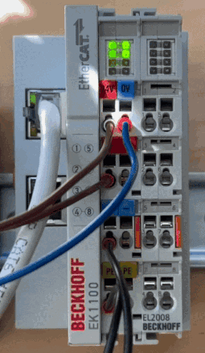
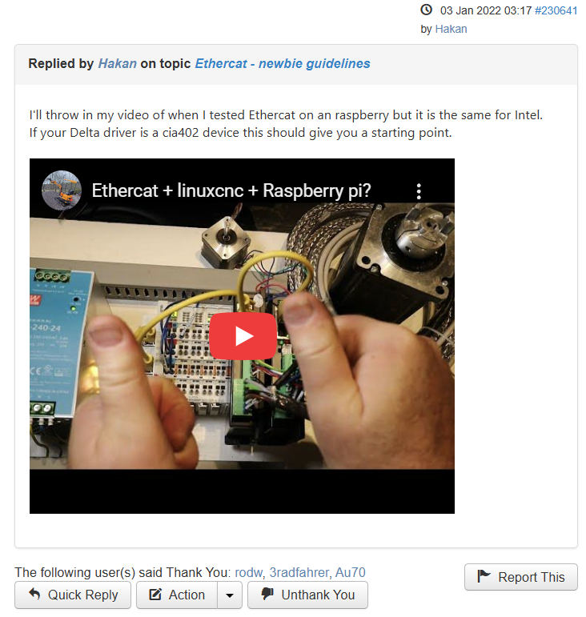
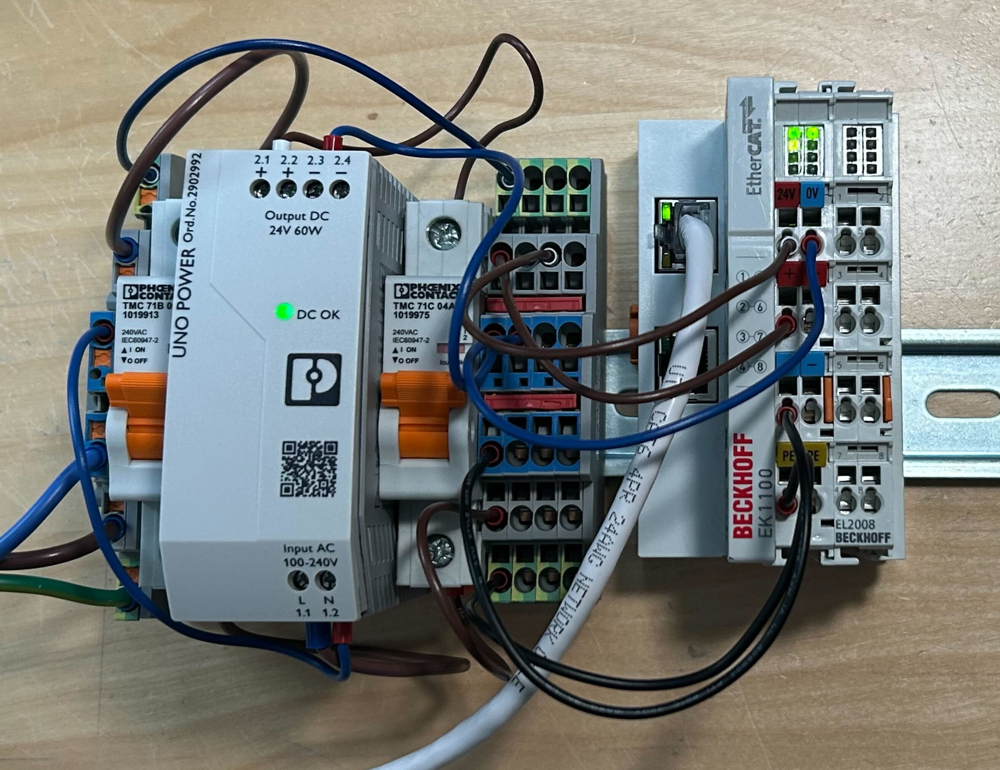
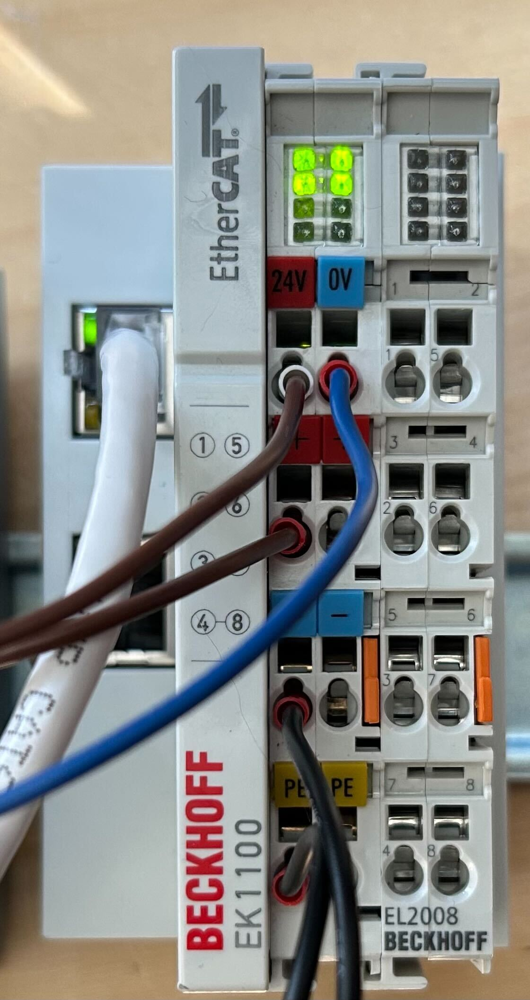
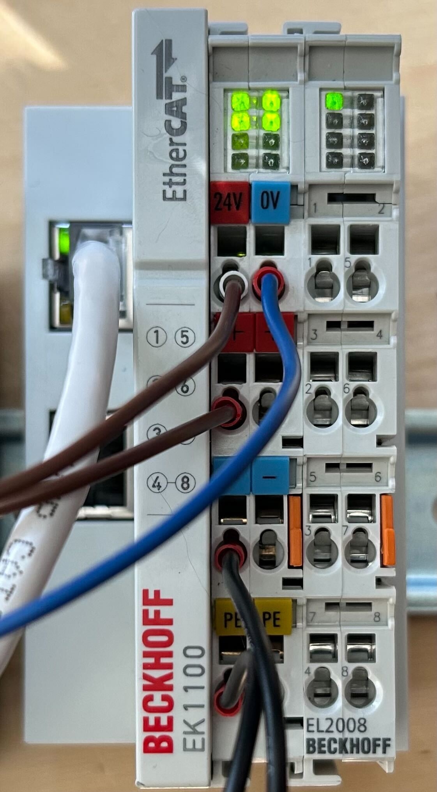

# Basic Digital Outputs Example

Alright, so you've read a little bit about how HAL works, but you're trying to figure out the next steps to actually make an LED blink. This example should give you enough tools to create a blinking LED version of a "hello world" program.

## Overview
* [Hardware Overview](#hardware-overview)
* [Required Reading](#required-reading)
* [LinuxCNC Ethercat Setup](#linuxcnc-ethercat-setup)
* [Basic Digital Outputs](#basic-digital-outputs)

## Hardware Overview
* [EK1100 | EtherCAT Coupler](https://www.beckhoff.com/en-us/products/i-o/ethercat-terminals/ek1xxx-bk1xx0-ethercat-coupler/ek1100.html)
    * The EK1100 copules an ethernet connection with the EtherCAT devices
* [EL2008 | EtherCAT Terminal, 8-channel digital output, 24 V DC, 0.5 A](https://www.beckhoff.com/en-us/products/i-o/ethercat-terminals/el2xxx-digital-output/el2008.html)
  * Though this tutorial should be compatible with [any supported Beckhoff EtherCAT digital output module](https://github.com/linuxcnc-ethercat/linuxcnc-ethercat/blob/master/documentation/DEVICES.md)

## Goal

Construct a basic "hello world" blinking light with a Beckhoff EL2008 and LinuxCNC.



## Required Reading

I'm not your real dad, I have no authority over you. But if you're starting out your journey into LinuxCNC it would do you well to grok the resources in the [main readme](../readme.md) and especially below. Some of these felt buried and hard to discover, so I'm doing my best to bring them to light.

### [EtherCAT installation from repositories - how to step by step](https://forum.linuxcnc.org/ethercat/45336-ethercat-installation-from-repositories-how-to-step-by-step)

Rodw has an excellent post that details how to configure `linuxcnc-ethercat` for use with LinuxCNC. His post covers the basic installation required to get going. Read it and follow it step-by-step.

###  [HAL Tutorial](https://linuxcnc.org/docs/stable/html/hal/tutorial.html)
This tutorial does a great job of introducing HAL, and HAL tools including `halshow` and `halscope`.

### [LinuxCNC EtherCAT XML Configuration Reference](https://github.com/linuxcnc-ethercat/linuxcnc-ethercat/blob/master/documentation/configuration-reference.md)

This doc from the [`linuxcnc-ethercat` repo](https://github.com/linuxcnc-ethercat/linuxcnc-ethercat) does a pretty good job of explaining how to build the XML that describes the physically attached modules. 

### [Ethercat + linuxcnc + Raspberry pi?](https://www.youtube.com/watch?v=NQ-HnrusGJo)
While stumbling around trying to learn how to set up EtherCAT with LinuxCNC I came across a [reply](https://forum.linuxcnc.org/ethercat/43459-ethercat-newbie-guidelines#230641) by user [Hakan](https://forum.linuxcnc.org/cb-profile/22448-hakan). In this video he goes through the process of setting up LinuxCNC on a Raspberry Pi as well as installing `linuxcnc-ethercat`. This video is really what unlocked digital IO for me.

<a href="https://forum.linuxcnc.org/ethercat/43459-ethercat-newbie-guidelines#230641">
  
</a>

## LinuxCNC Ethercat Setup
Hopefully this is pretty boring and straightforward. 
1. Follow the [post by Rodw](https://forum.linuxcnc.org/ethercat/45336-ethercat-installation-from-repositories-how-to-step-by-step) and make sure you can run the command `ethercat slaves` successfully

```bash
paul@Precix:~$ ethercat slaves
0  0:0  PREOP  +  EK1101 EtherCAT-Koppler (2A E-Bus, ID-Switch)
1  0:1  PREOP  +  EL2024 4K. Dig. Ausgang 24V, 2A
2  0:2  PREOP  +  EL1018 8Ch. Dig. Input 24V, 10�s
3  0:3  PREOP  +  EL7041 1K. Schrittmotor-Endstufe (50V, 5A)
```
_note: your output will almost certainly be different from mine_

## Basic Digital Outputs

Let's take what we've learned and apply it to a basic toy setup.

### The Setup

If you'll excuse my overkill power situation and lazy wiring, let's start with a basic setup consisting of two modules:
1. [EK1100 | EtherCAT Coupler](https://www.beckhoff.com/en-us/products/i-o/ethercat-terminals/ek1xxx-bk1xx0-ethercat-coupler/ek1100.html)
    * The EK1100 copules an ethernet connection with the EtherCAT devices
1. [EL2008 | EtherCAT Terminal, 8-channel digital output, 24 V DC, 0.5 A](https://www.beckhoff.com/en-us/products/i-o/ethercat-terminals/el2xxx-digital-output/el2008.html)



### Checking The Setup

With our LinuxCNC machine connected to our EK110, let's run a sanity-check command to make sure we can communicate. Let's ask the computer which EtherCAt devices are connected to it with `ethercat slaves`

```bash
paul@Precix:~$ ethercat slaves
0  0:0  PREOP  +  EK1100 EtherCAT Coupler (2A E-Bus)
1  0:1  PREOP  +  EL2008 8K. Dig. Ausgang 24V, 0.5A
```

Great! The computer sees our two devices. Let's look in detail at the response. The format can be interpreted as follows:

| Module Index | Master Index | Slave Index | State | Description |
|----|----|----|----|----|
| 0 | 0 | 0 | PREOP | EK1100 EtherCAT Coupler (2A E-Bus) |
| 1 | 0 | 1 | PREOP | EL2008 8K. Dig. Ausgang 24V, 0.5A |

Here are a couple examples of different setups.
<details>
    <summary>Example with daisy-chained EK1100s</summary>

```bash
paul@Precix:~$ ethercat slaves
0  0:0  PREOP  +  EK1100 EtherCAT Coupler (2A E-Bus)
1  0:1  PREOP  +  EL2008 8K. Dig. Ausgang 24V, 0.5A
2  0:2  PREOP  +  EK1101 EtherCAT-Koppler (2A E-Bus, ID-Switch)
3  0:3  PREOP  +  EL2024 4K. Dig. Ausgang 24V, 2A
4  0:4  PREOP  +  EL1018 8Ch. Dig. Input 24V, 10�s
```
</details>

<details>
    <summary>Example with the slaves running</summary>

```bash
paul@Precix:~$ ethercat slaves
0  0:0  OP  +  EK1100 EtherCAT Coupler (2A E-Bus)
1  0:1  OP  +  EL2008 8K. Dig. Ausgang 24V, 0.5A
```
</details>

### Writing Code

Let's create an XML config file so we can tell `linuxcnc-ethercat` what we have physically built, and then let's create a `.hal` file to make some lights blink.

### Coding Setup

Let's organize our code because we aren't troglodytes. In this example code we'll put all of our code into a folder named `basics` in our home folder. If you clone this repo you can find the example code in a matching [basics](./basics/) folder. 

```bash
paul@Precix:~$ cd ~
paul@Precix:~$ mkdir basics
paul@Precix:~$ cd basics
paul@Precix:~/basics$ 
```

### XML Configuration

Using the [XML configuration reference](https://github.com/linuxcnc-ethercat/linuxcnc-ethercat/blob/master/documentation/configuration-reference.md) and the output from `ethercat slaves` above, we should have all the information we need to build our `ethercat-config.xml` file

```xml
<masters>
  <master idx="0" appTimePeriod="1000000" refClockSyncCycles="1000">
    <slave idx="0" type="EK1100" />
    <slave idx="1" type="EL2008" />
  </master>
</masters>
```

Let's break the above apart to better understand what's going on, starting with the outermost XML

```xml
<masters>
</masters>
```

This block tells `linuxcnc-ethercat` that we're about to describe all of the masters that we're going to use in our system. In our case, we only have one, so let's add it 

```xml
<masters>
  <master idx="0" appTimePeriod="1000000" refClockSyncCycles="1000">
  </master>
</masters>
```

Here we tell `linuxcnc-ethercat` that we have one master, and then we use a couple XML attributes to configure it:
* we set `idx` to `0` so that it lines up with what we saw in the output of `ethercat slaves`
* we configure `appTimePeriod` to be `1000000`, a.k.a. 1,000,000 nanoseconds, a.k.a. 1 millisecond. `appTimePeriod` effectively configures how many times per second the outputs can be updated. This is a fairly arbitrary value for now, but for this project (and most motion projects) 1,000 updates per second is plenty sufficient.
  * This value needs to match what we configure in our `.hal` file later.
* we configure `refClockSyncCycles` to be `1000`. This tells `linuxcnc-ethercat` how frequently to update the distributed clocks across the EtherCAT slaves. Most examples I have come across set it to `1000`. 

Next we can start configuring our modules. The `linuxcnc-ethercat` developers provide a list of [supported modules](https://linuxcnc-ethercat.github.io/linuxcnc-ethercat/DEVICES.html) and would-ya-look-at-that the EK1100 and EL2008 have support out of the box. What this means is that we don't need to leverage the `generic` congfiguration and instead can just tell `linuxcnc-ethercat` which devices we're using. 

`~\basics\ethercat-config.xml`
```xml
<masters>
  <master idx="0" appTimePeriod="1000000" refClockSyncCycles="1000">
    <slave idx="0" type="EK1100" />
    <slave idx="1" type="EL2008" />
  </master>
</masters>
```

Here we tell `linuxcnc-ethercat` that we have two slaves. For each one we set the `idx` and `type` attributes to match what we received from the `ethercat slaves` command.

### HAL Setup

Next let's work on building up the `.hal` file one line at a time. Let's use `halrun` to enter the commands as we go. 

Let's begin by starting `halrun`:
```bash
paul@Precix:~/basics$ halrun
halcmd:
```

This starts `halrun` and lets us test commands on the fly.

Next let's load the EtherCAT config file we just wrote

```bash
halcmd: loadusr -W lcec_conf ethercat-config.xml
halcmd: 
```

[loadusr](https://www.linuxcnc.org/docs/html/hal/basic-hal.html#sub:hal-loadusr) line tells `halrun` to load the configuration file with `lcec_conf` so that `linuxcnc-ethercat` can know which modules we have.

Next let's load the `linuxcnc-ethercat` realtime component

```hal
halcmd: loadrt lcec
Note: Using POSIX realtime
halcmd: 
```

This loads the `linuxcnc-ethercat` realtime compoment and all the black magic therein.

We have a couple more steps we need to take before we can make any LEDs turn on. The first is creating a HAL [thread](https://linuxcnc.org/docs/2.4/html/man/man9/threads.9.html) that will trigger `lcec` to read from and write to the hardware. In this example we'll use a single thread, but most projects will be more selective about threading.

```hal
halcmd: loadrt threads name1=lcec-thread period1=1000000
halcmd:
```

Notice two things here:
* We named the thread `lcec-thread`, we'll use this to attach components to it later
* We set our period to `1000000`. For the thread that `lcec` uses, this value needs to match the `appTimePeriod` value we defined above in `ethercat-config.xml`

Now that we have a thread we can use it to trigger the functions `lcec.read-all` and `lcec.write-all` every millisecond

```hal
halcmd: addf lcec.read-all lcec-thread
halcmd: addf lcec.write-all lcec-thread
halcmd:
```

One final step is required to get everything running, we need to tell it to start

```hal
halcmd: start
halcmd:
```

Tada! We now have `linuxcnc-ethercat` running! We can prove it by running `ethercat slaves` in another window and seeing that our EK1100 and EL2008 modules are in `OP` mode instead of `PREOP`

```bash
paul@Precix:~/basics$ ethercat slaves
0  0:0  OP  +  EK1100 EtherCAT Coupler (2A E-Bus)
1  0:1  OP  +  EL2008 8K. Dig. Ausgang 24V, 0.5A
```

We can also prove it by sending a command to control the output. Right now all of the LEDs on the EL2008 should be off



Let's send a command to output 24V on channel 0, as indicated by the top left LED

```hal
halrun: setp lcec.0.1.dout-0 1
halrun:
```

Behold!



This is great and all, but I promised a blinking LED.

Next let's use what we learned in the [Hal Tutorial](https://linuxcnc.org/docs/stable/html/hal/tutorial.html) and hook up the LED to the clock of a `siggen` function.

Let's start by loading `siggen` and attaching it to the thread

```hal
halrun: loadrt siggen
halrun: addf siggen.0.update lcec-thread
halrun:
```

And then _finally_ we can create a net that will connect the `siggen` and `lcec`

```hal
halrun: net channel-0-led => lcec.0.1.dout-0
halrun: net channel-0-led <= siggen.0.clock
halrun:
```

Behold again!


We can glue it all together into a single file:

`el2008.hal`
```hal
loadusr -W lcec_conf ethercat-config.xml
loadrt lcec

loadrt threads name1=lcec-thread period1=1000000

addf lcec.read-all lcec-thread
addf lcec.write-all lcec-thread

loadrt siggen

addf siggen.0.update lcec-thread

net channel-1-led => lcec.0.1.dout-0
net channel-1-led <= siggen.0.clock

start
```

And run it all with a single command

```bash
paul@Precix:~/basics$ halrun -I -f el2008.hal 
Note: Using POSIX realtime
halcmd: 
```

If blinking on and off once a second isn't your cup of tea, you can now start playing with `siggen` parameters to make it blink faster (or slower) using `siggen.0.frequency`, a parameter that sets the frequency of the signal generator in Hz. 

```hal
halrun: setp siggen.0.frequency 2
```

And your LED should blink twice as fast now.

# END

That's it, that's all I've got for this demo.
