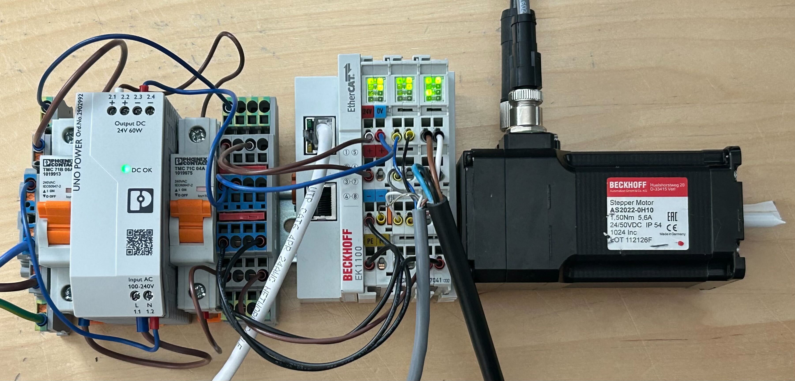
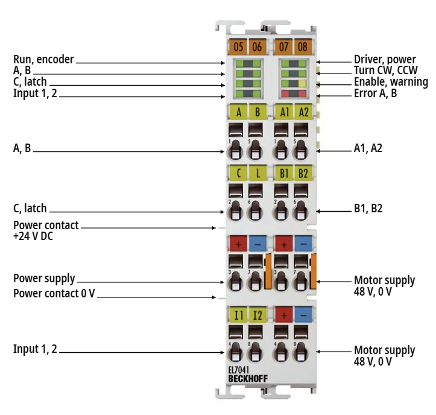
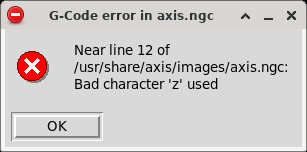
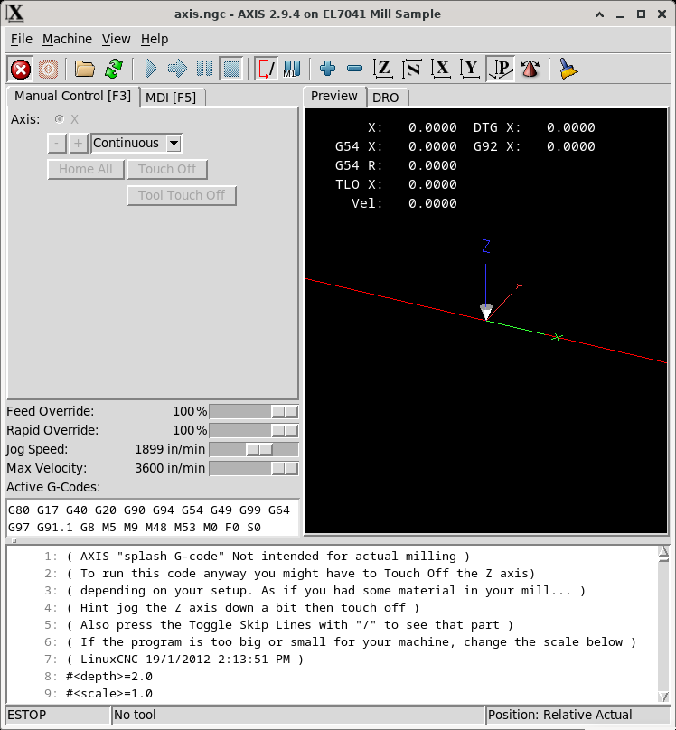
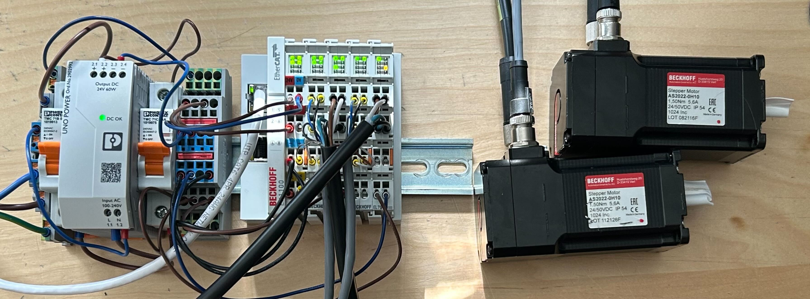
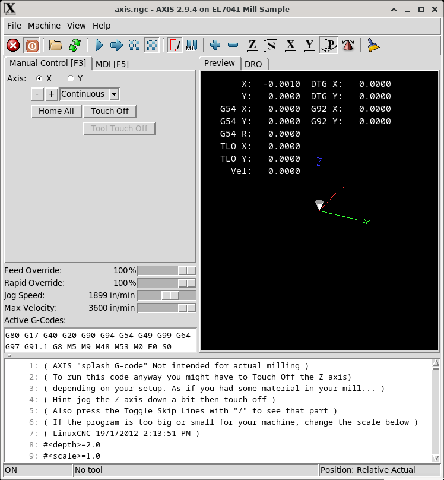
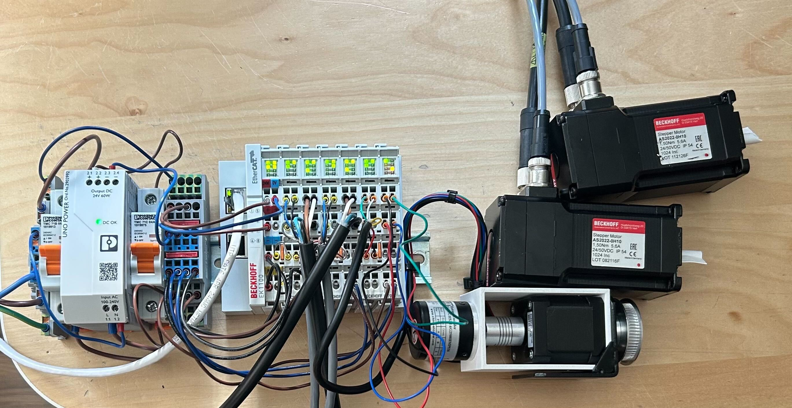
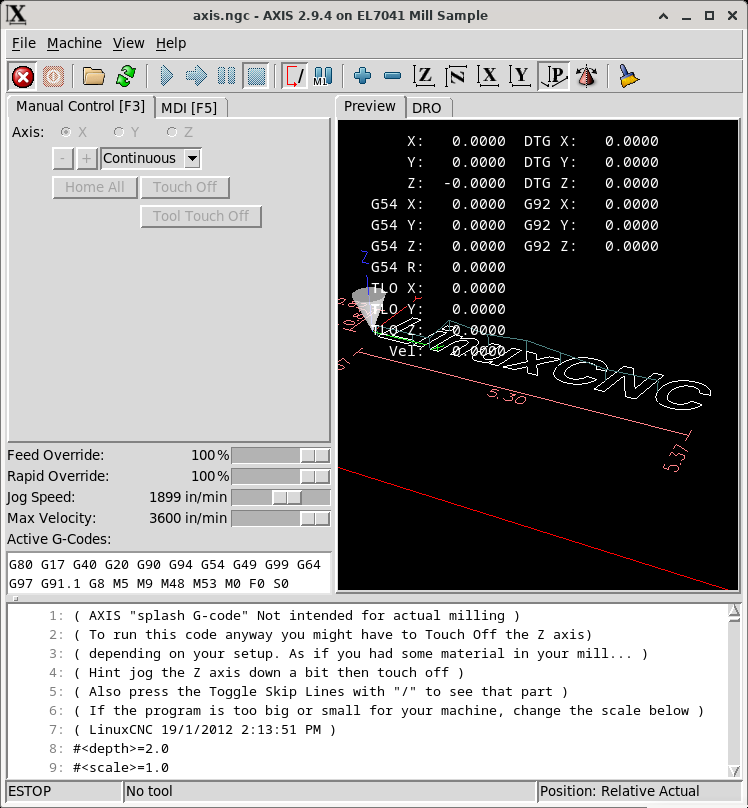

# Stepper Motor Tutorial

_note: I'm still learning LinuxCNC and motor tuning, but I'm hoping this will get you off the ground in less time than I took_

Hopefully this tutorial will help you get set up using a Beckhoff EL7041 stepper driver.



## Overview
* [Hardware Overview](#hardware-overview)
* [Required Reading](#required-reading)
* [Stepper Motor Example](#stepper-motor-example)
* [Dual Stepper Motor Example](#dual-stepper-motor-example)

## Hardware Overview
* [EK1100 | EtherCAT Coupler](https://www.beckhoff.com/en-us/products/i-o/ethercat-terminals/ek1xxx-bk1xx0-ethercat-coupler/ek1100.html)
    * The EK1100 copules an ethernet connection with the EtherCAT devices
* [EL7041 | EtherCAT Terminal, 1-channel motion interface, stepper motor, 48 V DC, 5 A, with incremental encoder
](https://www.beckhoff.com/en-us/products/i-o/ethercat-terminals/el-elm7xxx-compact-drive-technology/el7041.html)

* Some flavor of stepper motor and and encoder
    * I'll be using an [AS2022 | Stepper motor, holding torque 1.50 Nm, N2 (NEMA23/56 mm)
    ](https://www.beckhoff.com/en-us/products/motion/compact-drive-technology/asxxxx-stepper-motors/as2022.html) but I'll also demonstrate with a [Nema 17 Stepper](https://www.amazon.com/dp/B00W98YK5M) and [rotary encoder](https://www.amazon.com/dp/B01EWK933S) from Amazon. 


## Required Reading

### [Basic Digital Outputs](../basic_digital_outputs/readme.md)

The basic EtherCAT example in this repo should help you get off the ground. Once you grok that come back and let's move forward with steppers.

### [Ethercat 64 bit stepper drive basic example EL7041](https://forum.linuxcnc.org/27-driver-boards/35717-ethercat-64-bit-stepper-drive-basic-example-el7041#319333)

LinuxCNC forum user Grotius posted an excellent example and we'll mostly be working from it, but hopefully with more detailed explanations


### [LinuxCNC Ethercat Docs - EL7041](https://linuxcnc-ethercat.github.io/linuxcnc-ethercat/el7041.html)
This page demonstrates ways to configure the EL7041 modules directly from the XML.

## Stepper Motor Example

Let's build an axis in LinuxCNC!

### [`1-axis-el7041-conf.xml`](./files/1-axis/1-axis-el7041-conf.xml)
Let's start by creating our `1-axis-el7041-conf.xml` file:
```xml
<masters>
  <master idx="0" appTimePeriod="100000" refClockSyncCycles="5">
    <slave idx="0" type="EK1100" />
    <slave idx="1" type="EL7041-1000" name="x-axis">
        <!-- Note, if you don't set this, it will remember whatever setting was used last -->
		<modParam name="maxCurrent" value="4" />
		<modParam name="nominalVoltage" value="24.0" />
        <!-- The "encoder" parameter enables or disables the virtual encoder. Set to false if you're using a hardware encoder -->
		<modParam name="encoder" value="false" /> 
		<!-- <modParam name="microsteps" value="1" /> -->
	</slave>
  </master>
</masters>
```

Since our [last example](../basic_digital_outputs/basics/ethercat-config.xml) you'll notice a couple changes. 

The first being that one of our slaves has an additional attribute `name`. This attribute gives us a convenient way of referring to this axis. Recall that [in the past](../basic_digital_outputs/readme.md) we used the `setp` command in `halrun` to set parameters, i.e. `setp lcec.0.1.dout-0 1` (where we turned on channel 0 of master `0`s slave `1`). By utilizing the `name` attribute in the XML we can give our slave a name `x-axis` and refer to it in `halrun` via `lcec.0.x-axis` for all of our HAL configurations. 

The second being that we're utilizing the `modParam` elements of the slaves. You should recall from the [LinuxCNC Ethercat Docs - EL7041](https://linuxcnc-ethercat.github.io/linuxcnc-ethercat/el7041.html) that the EL7041 driver exposes a suite of additional parameters (varying by exact model). In our example there are two that really matter.
* The first being the `maxCurrent` that we're allowing through our motor. My AS2022 accepts up to 5.6A, but my tiny Nema 17 can only handle 1.68A, so this setting will vary by motor. 
* The second being the `nominalVoltage` that the EL7041 shoudl expect. The EL7041 accepts a separate motor power supply on pins 4\` and 8\` and you'll want to make sure your `nominalVoltage` parameter matches the voltage provided.
    * If this doesn't match you'll see warning LED illuminated the flag `srv-warning` set. (in this example case the full path would be `lcec.0.x-axis.srv-warning`)

**Warning:** If you fail to set `modParams`, the drives will remember their last-used settings. One of my drives was set to use a strange `microsteps` value and it took me a while to realize it. It's better to play it safe and always set the settings you expect to use every time. 

### `1-axis-el7041.hal` and `1-axis-mill.ini`

These two files are deeply intertwined and I won't pretend to know everything about them. I will do my best to comment them with links to documentation so that as you go through them you can easily look up what is doing what. I've stripped the `.ini` file down to what I believe is the minimum required for the example; there are MANY more [configuration settings available](https://linuxcnc.org/docs/html/config/ini-config.html) and it would do you well to learn about them.

### Run it

From the command line, navigate to the directory where you have these three files `1-axis-el7041-conf.xml`, `1-axis-el7041.hal`, `1-axis-mill.ini` and run the following command
```bash
paul@Precix:~/dev/el7041-example$ linuxcnc mill.ini
```
And you should see the LinuxCNC UI appear.

By default it loads a 3-axis g-code example, which is why it gets mad about the use of the `z` axis.



But once you click "OK" you should see the UI pop up



Now, if you're using the AS2022 like I am, you should be able to drive the axis back and forth without too much hassle. You may get some following errors, and if you do you'll want to tune the velocity, acceleration, and PID settings. 

Once you've hit the "Home All" button you should even be able to go into the Manual Data Input (MDI) and send G-Code commands to the X-Axis like
```
G1 X10 F1000
```
and have it move 10 units.

What's more is that you could even create and run a G-code program

#### example1.gc
```
G1 X0 F1000
X10 F1100
X20 F1200
X30 F1300
X40 F1400
X50 F1500
X60 F1600
X70 F1700
X80 F1800
X90 F1900
X100 F1000
G1 X0 F1000
M2
```
## Dual Stepper Motor Example

One axis is cool and all, but what about two?



Changes required:
* Add another matching slave to the `XML` file
* In the `hal` file duplicate any reference to the x-axis with a reference to the y-axis and update any joint `0` references to `1`
* Update the mill file to include the new axis
* Update the `.ini` file
  * Set`XY` set for `[TRAJ]COORDINATES`
  * Set `coordinates=XY` for `[KINS]KINEMATICS`
  * Set `2` for `[KINS]JOINTS`
  * Duplicate the `AXIS_X` and `JOINT_0` sections to reflect a new `AXIS_Y` and `JOINT_1`. 

_For reference I've put these example files in the [2-axis](./files/2-axis/) folder_

And viola!



## Triple Stepper Motor Example

Alright, two is neat, but have you really lived until you've had 3?



The setup is more rinse and repeat, however because ~~I'm poor~~ I don't have a third AS2022 I need to swap in some encoder and motor specific values for the third motor.

_For reference I've put these example files in the [3-axis](./files/3-axis/) folder_



With all 3-axes set up we can finally run the example G-Code that comes with LinuxCNC!

## End

That's all I've got for this demo/tutorial
